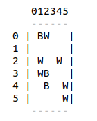
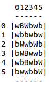
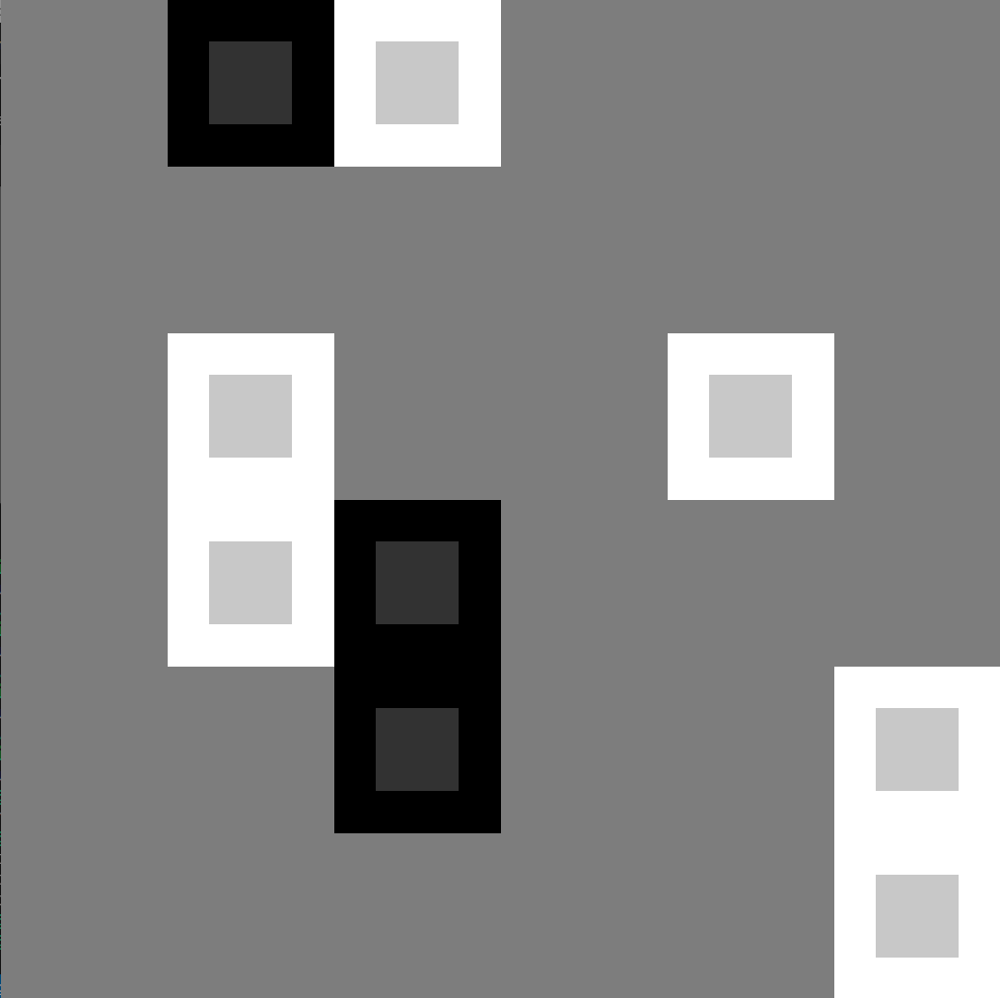
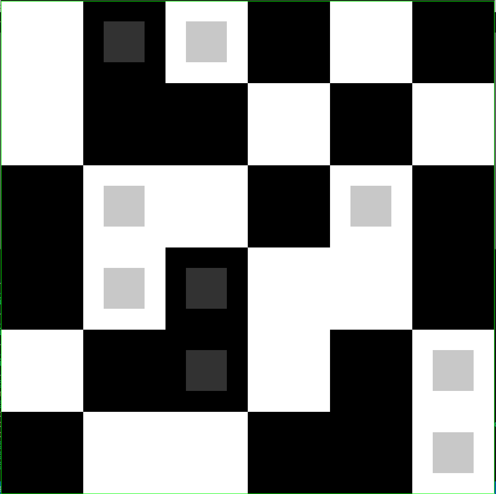

<link rel="stylesheet" href="readme.css">

# Technological Project, TM12 team : 
Making a 2D video game: **Takuzu**.
The game Takuzu is a single-player logic puzzle.

The program allows to play the game "Takuzu". The code is written in C language. It includes 11 executable files, 5 libraries and 2 text files.

    game.c                              game.h
    game_aux.c                          game_aux.h
    game_tools.c                        game_tools.h
    game_solve.c                    
    game_text.c                         game_ext.h
    queue.c                             queue.h
    main.c
    game_sdl.c                          game_sdl.h
    game_test_emtexier.c
    game_test_tvieiradoval.c            test.txt
    game_test_aupasquet.c               moves.txt

## Our project on GitLab

> https://gitlab.emi.u-bordeaux.fr/pt2/teams/tm12/takuzu-12a

## Rules and game representation

Given a grid of squares, you must fill it with black and white squares. Some squares are initially provided as clues and are immutable. You must complete the remaining empty squares, according to the following rules.

    - Each row and column must contain the same number of blacks and whites.
    - No row or column may contain three consecutive squares of the same color.

Our game also include two extra rules :
    - "uniqueness : no two rows or two columns may contain the same exact sequence of blacks and whites. (A row and a column can match, though.)
    - "wrapping" : the top of the grid communicates with the bottom of the grid, and the left side communicates with the right side.
    
The functions related to these rules are implemented in game_ext.c 

Moreover, our game can be a square or a rectangle, of size nxm. By convention, the square in the i-th row and j-th column of the grid corresponds to the coordinate (i,j), and the coordinate (0,0) corresponds to the top left corner (like in a matrix).

In summary, the game uses 5 different square states, that are :

    - empty
    - white
    - black
    - immutable white
    - immutable black

# To play ! : beta version (play in the terminal)

Command to be executed in a terminal : ./game_text

Keyboard commands :

    - 'w <i> <j>' to put a white at square (i,j)
    - 'b <i> <j>' to put a black at square (i,j)
    - 'e <i> <j>' to empty square (i,j)
    - 'z' to undo the last move
    - 'y' to redo the last move
    - 'r' to restart
    - 's' to save the game
    - 'q' to quit

Note that immutable squares are represented with an uppercase character : 'W' (white immutable) and 'B' (black immutable).

As an example, let's see the instance of the game, considered thereafter as the default game:

Hereafter, its solution:

# To play ! : graphic version (the best one)

Command to be executed in a terminal to play : ./game_sdl <game_file>
(./game_sdl : starts the default game)

Mouse commands :

    - right click : set a black
    - left click : set a white
    - wheel click : set an empty

Keyboard commands :

    - "esc" or "q" : quit
    - "r" : restart
    - "z" : undo the last action
    - "y" : redo the last action
    - "s" : solve the game

Note : 
    - the immutable squares appear with a small grey square relief in the middle\
    - when there is a mistake on a square, the square is surrounded by red\
    - when you win the game, the grid is surrounded by green\

As an example, let's see the instance of the game, considered thereafter as the default game:

Here is an example of a blank game at the beginning :

Hereafter, its solution :

# Project Architecture

Our project is based on a single library named game library (libgame.a), whose interface is divided into several header files:

    Basic Game Functions: game.h
    Auxiliarry Game Functions: game_aux.h
    Advanced Game Functions : game_ext.h
    Allow the game to be loaded, saved or given the solution : game_tools.h
    Graphics library : game_sdl.h

Based on this library, our project will provide several programs, including the following:

    game_text: a simple text-based program to play our game in a terminal ;
    game_test: a program with many tests to check the validity of the library functions ;

# Support

If you notice an error or if you have any constructive comments about our game, feel free to write to us at the email address below! We will be happy to answer you!
> emie.texier@etu.u-bordeaux.fr

# Roadmap

Be lenient! This project is not yet finished, in the future we will write a cleaner report in Latex, and finally, add our game on the web and on android, so that it is accessible to everyone!

# Authors and acknowledgment

This project was carried out with love by Thomas Vieira Do Vale, Aurélien Pasquet and Emie Texier, Bachelor’s students in Mathematics and Computer Science at the University of Bordeaux. We were very happy to participate in the development of this Takuzu game and we hope you like it!

# License

Copyright (c) 2023. Thomas Vieira Do Vale. Aurélien Pasquet. Emie Texier.
